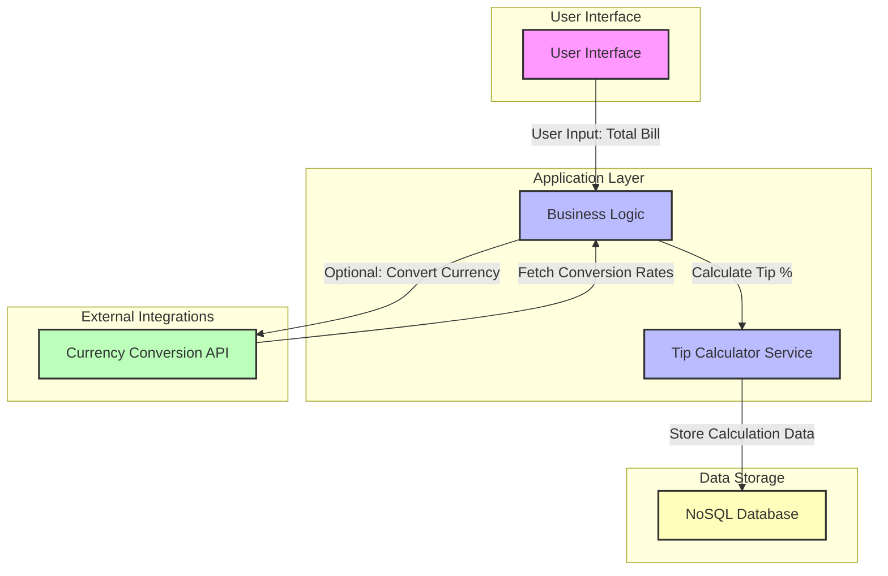

Certainly! Below is a markdown file containing a Mermaid.js flowchart representing the high-level system architecture for a Tip Calculator application. The diagram includes layers, technology choices, external integrations, and data storage.

```markdown
# Tip Calculator Application Architecture Diagram


```

### Description

- **User Interface Layer:** This layer allows the user to input the total bill amount.
  
- **Application Layer:** 
  - The `Business Logic` component processes the user input and interacts with other services.
  - The `Tip Calculator Service` performs the calculation of different tip percentages based on the total bill.

- **External Integrations:**
  - The application can optionally interact with a `Currency Conversion API` to convert the tip into different currencies if required.

- **Data Storage:**
  - A `NoSQL Database` is used to store calculation data and user preferences, which can be useful for analytics or future enhancements.

This architecture provides a clear separation of concerns across different layers and shows a simple integration with an external service for additional functionality.
