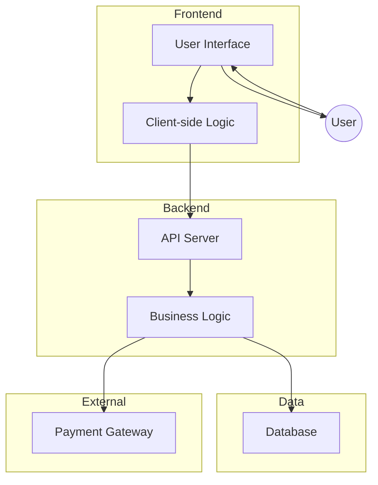

```markdown

```
This diagram shows the components of a tip calculator application organized by layer, with arrows indicating dependencies and interactions. The frontend layer contains the user interface and client-side logic, the backend layer handles the API and business logic, the data layer consists of a database, and an external payment gateway is also depicted.