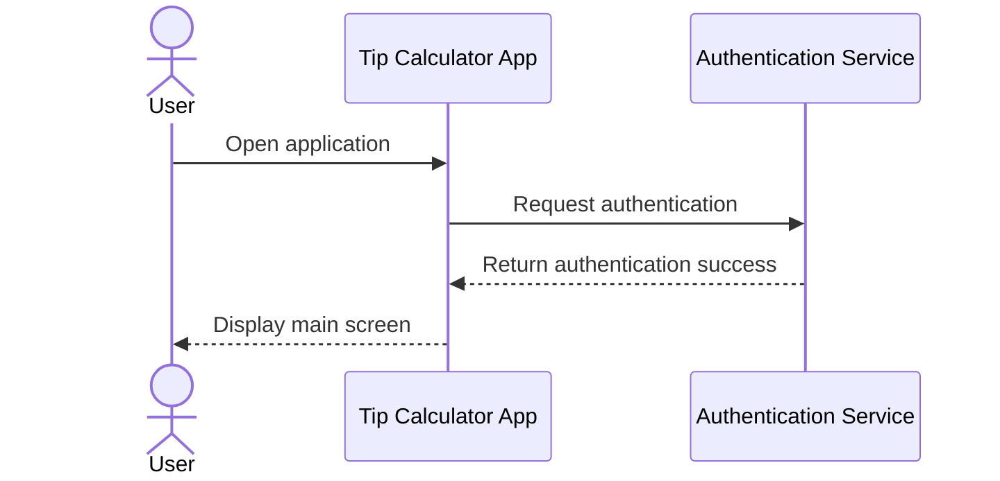
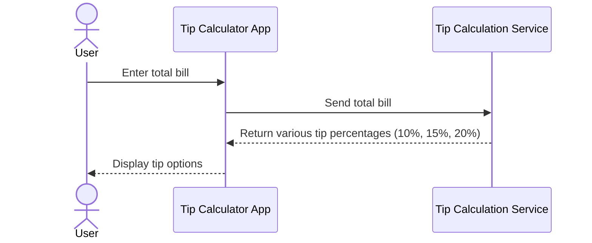
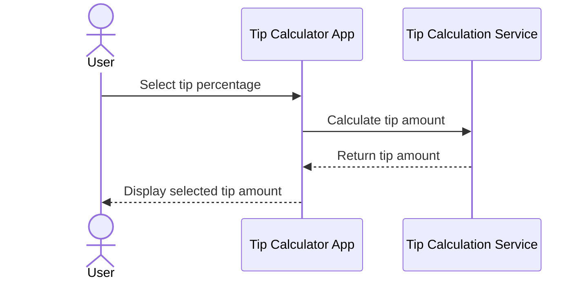
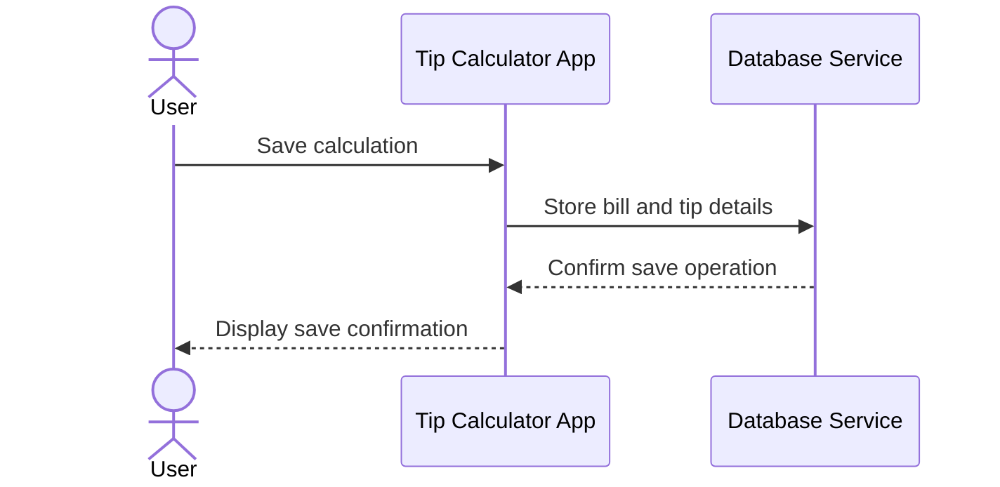
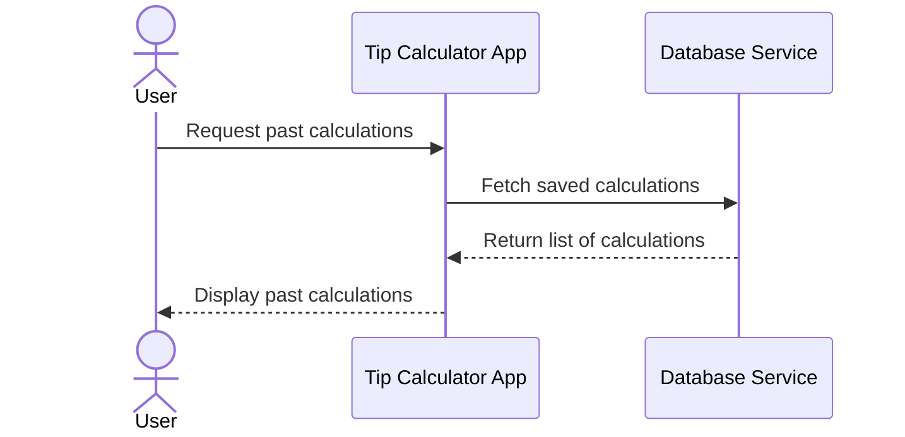

Certainly! Below is a markdown file containing Mermaid.js sequence diagrams for a tip calculator application. The diagrams represent key user flows, including authentication, data operations, and main features.

```markdown
# Tip Calculator Application Sequence Diagrams

## 1. User Authentication Flow



## 2. Enter Total Bill and Calculate Tip



## 3. Select Tip Percentage and Display Tip Amount



## 4. Save Tip Calculation



## 5. View Past Calculations


```

These sequence diagrams illustrate the main interactions within the tip calculator application, covering authentication, entering and calculating tips, saving calculations, and viewing past calculations. Each diagram uses actors and participants to clearly define user interactions and system operations.