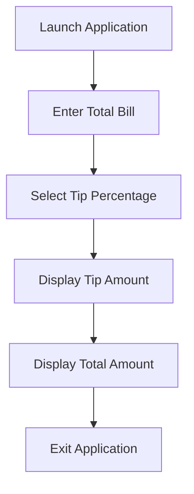
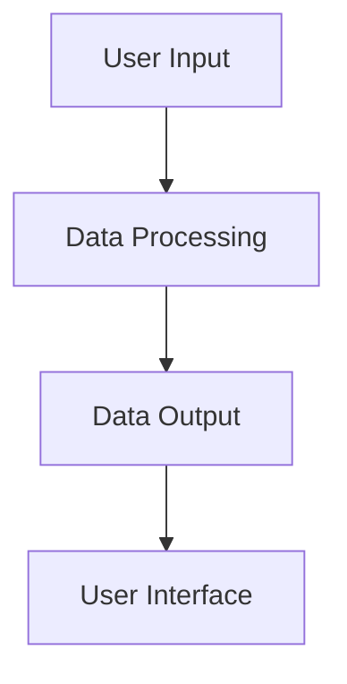
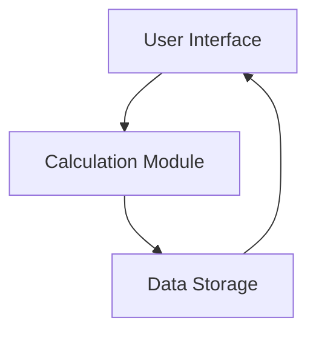
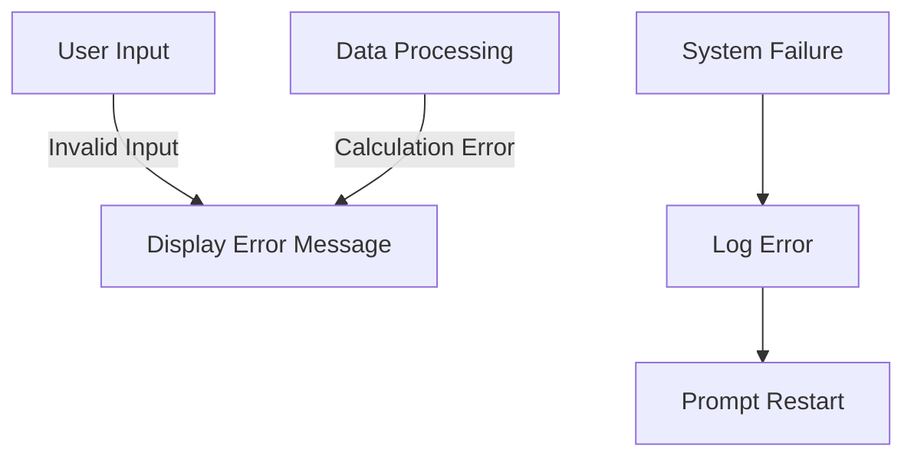

# Tip Calculator Application System Flow Documentation

## 1. User Workflows

### Overview
This section outlines how users will interact with the Tip Calculator application.

### User Journey

1. **Launch Application**
   - User opens the Tip Calculator application on their device.
   
2. **Enter Total Bill**
   - User inputs the total bill amount into the application.

3. **Select Tip Percentage**
   - Application displays various tip percentages (e.g., 10%, 15%, 20%).
   - User selects their desired tip percentage.

4. **Display Tip Amount**
   - Application calculates and displays the tip amount based on the selected percentage.

5. **Display Total Amount**
   - Application calculates and displays the total amount including the tip.

6. **Exit Application**
   - User closes the application.

### User Workflow Diagram

## 2. Data Flows

### Overview
This section describes how data moves through the system, from user inputs to outputs.

### Data Flow

1. **User Input**
   - User inputs the total bill amount and selects a tip percentage.
   
2. **Data Processing**
   - System processes the input to calculate the tip amount.
   
3. **Data Output**
   - System outputs the calculated tip and total amounts to the user interface.

### Data Flow Diagram

## 3. Integration Points

### Overview
This section details how different components of the system connect and interact.

### Components

1. **User Interface**
   - Provides an interface for user input and displays outputs.

2. **Calculation Module**
   - Processes input data to compute tip and total amounts.

3. **Data Storage (Optional)**
   - Stores previous calculations for future reference (could be a local database or in-app storage).

### Integration Diagram

## 4. Error Handling

### Overview
This section outlines strategies for managing failures and ensuring smooth user experience.

### Error Scenarios

1. **Invalid Input**
   - **Description**: User enters a non-numeric value or negative number as the total bill.
   - **Handling**: Display an error message prompting the user to enter a valid number.

2. **Calculation Errors**
   - **Description**: Errors occur during the calculation process (e.g., division by zero).
   - **Handling**: Implement try-catch blocks to catch and handle exceptions, displaying an error message if necessary.

3. **System Failures**
   - **Description**: Application crashes or becomes unresponsive.
   - **Handling**: Implement logging to capture errors, and provide a user-friendly message prompting the user to restart the application.

### Error Handling Diagram

This documentation provides a clear understanding of the system's operation, aiding development and ensuring a seamless user experience.